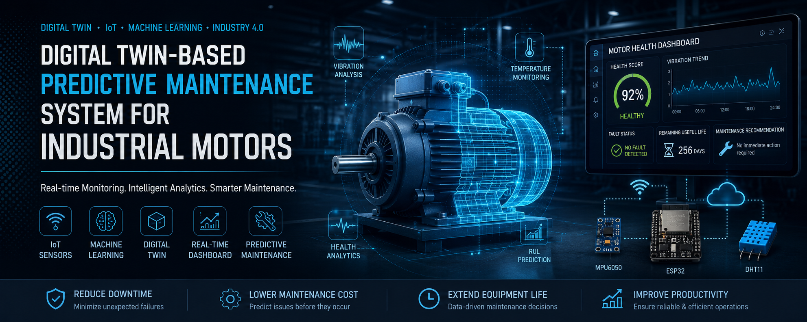
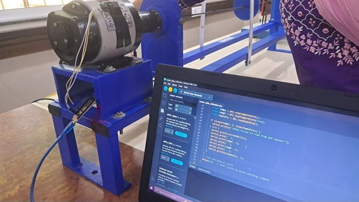

# 🚀 Development of a Digital Twin-Based Predictive Maintenance System for Industrial Motors

> **An Industry 4.0 project integrating IoT, Machine Learning, and Digital Twin technology for real-time industrial motor health monitoring and predictive maintenance.**




# 📸 Project Showcase

<table>
<tr>
<td align="center">

### Dashboard


</td>

<td align="center">

### Digital Twin


</td>
</tr>

<tr>
<td colspan="2" align="center">

### Hardware Setup



</td>
</tr>
</table>

---

# 📖 Overview

This project presents a **Digital Twin-Based Predictive Maintenance System** for industrial induction motors. The system combines **ESP32-based data acquisition**, **Machine Learning**, and an **interactive Digital Twin dashboard** to continuously monitor motor health, detect anomalies, classify faults, estimate Remaining Useful Life (RUL), and provide maintenance recommendations.

The project demonstrates how Industry 4.0 technologies can be integrated into a complete predictive maintenance workflow.

---

# ✨ Key Features

| Feature | Description |
|----------|-------------|
| 📡 Real-Time Monitoring | Continuous monitoring of motor parameters |
| 🏭 Digital Twin | Interactive visualization of motor health |
| 🧠 Machine Learning | Isolation Forest + XGBoost pipeline |
| ⚠ Fault Detection | Automatic anomaly and fault identification |
| ❤️ Health Score | Overall motor health assessment |
| ⏳ Remaining Useful Life | Predictive estimation of motor lifespan |
| 📊 Dashboard | Live analytics and monitoring |
| 🌐 REST APIs | Backend communication and prediction services |

---

# 🏗 System Architecture


---

# 🔄 Workflow


---

# 🧠 Machine Learning Pipeline


The prediction pipeline consists of:

- Feature Engineering
- Isolation Forest
- Rule-Based Expert System
- XGBoost Classifier
- Health Score Estimation
- Remaining Useful Life Estimation
- Maintenance Recommendation

---

# 💻 Technology Stack

| Category | Technologies |
|---|---|
| Language | Python, JavaScript |
| Backend | Flask, Flask-CORS |
| Machine Learning | Scikit-Learn, XGBoost |
| Frontend | HTML5, CSS3, JavaScript |
| Hardware | ESP32, MPU6050, DHT11 |
| Scientific Computing | NumPy, Pandas, SciPy |
| Simulation | MATLAB |
| Tools | VS Code, Git, GitHub |

---

# 📂 Repository Structure

Digital-Twin-Predictive-Maintenance-System
│
├── assets/
│   ├── banners/
│   ├── screenshots/
│   ├── demo/
│   └── icons/
│
├── backend/
│
├── frontend/
│
├── machine_learning/
│
├── datasets/
│
├── diagrams/
│
├── docs/
│
├── README.md
├── LICENSE
├── requirements.txt
└── .gitignore

---

# 📊 Results

The implemented system successfully demonstrates:

- Real-time monitoring
- Feature extraction
- Anomaly detection
- Fault classification
- Health Score computation
- Remaining Useful Life estimation
- Dashboard visualization

---

# ⚙ Installation

Clone the repository:

```bash
git clone https://github.com/keyurc2332/Digital-Twin-Predictive-Maintenance-System.git
cd Digital-Twin-Predictive-Maintenance-System
```

Install the required Python dependencies:

```bash
pip install -r requirements.txt
```

> **Note:** This repository contains the source code, documentation, and supporting resources developed as part of the project. Depending on your setup and available hardware (ESP32, sensors, etc.), additional configuration may be required to run the complete system.

# 🌐 REST API

| Endpoint | Method | Description |
|---|---|---|
| /status | GET | Backend status |
| /ingest | POST | Receive sensor data |
| /predict | GET | Latest prediction |
| /reset | POST | Reset state |

---

# 📄 Documentation

- docs/Final_Report.pdf
- docs/Project_Presentation.pdf

---

# 🔮 Future Scope

Possible future extensions include cloud deployment, multi-motor monitoring, historical analytics, Explainable AI (SHAP), and mobile applications. These were **not implemented** as part of the current project.

---

# 👥 Contributors

This project was developed collaboratively as a Bachelor of Engineering Final Year Project.

- Keyur Chauhan
- Shivangi Chouhan
- Arshiya Khan

**Project Guide:** Ms. Ekta Desai

---

# 🎓 Academic Information

**Institution:** Thakur College of Engineering and Technology (TCET)

**Department:** Internet of Things (IoT)

**Academic Year:** 2025–2026

---

# 📚 References

See the Final Report for detailed references and related literature.

---

# 📝 License

MIT License

---

# 📜 Citation

Development of a Digital Twin-Based Predictive Maintenance System for Industrial Motors.

Bachelor of Engineering Final Year Project

Thakur College of Engineering and Technology

2026

---

Made with ❤️ for Industry 4.0, IoT and Machine Learning.

